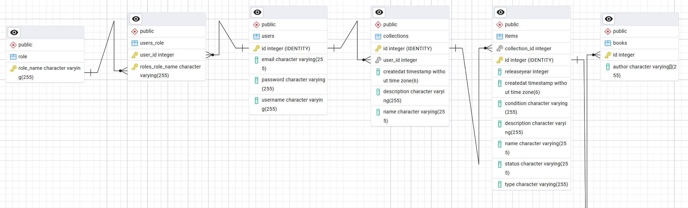

## Vision

> This project is a backend API for managing collection of items, so a collection tracker.
> The system allows the user to track various items, their state, what they are and so on.

---

## Links

Portfolio website:
https://linus-llm.github.io/portfolio/

Project overview video:
https://youtu.be/UKMt0CBDMnY

Deployed application: 
https://collectionapp.viskode.dk/

Source code repository: 
https://github.com/Linus-llm/CollectionApp

---

# Architecture

- Controller layer (REST endpoints)
- Service layer (business logic)
- Persistence layer (DAOS)

The technologies I have used:

- Java 17.0.16
- Javalin 6.7.0
- JPA/Hibernate 7.1.0
- PostgreSQL 16.2
- Maven 4.0.0
- JWT authentication 1.0.4 (TokenSecurity - Hartmannsolution)
- Hamcrest 2.2
- Restassured 6.0.0
- Bcrypt 0.4

The overview: 

Client --> Security Layer (Controller) --> REST (Controllers) --> Persistence layer (DAO's) --> Database 

Developer/User --> Service --> external API --> Service --> Developer/User --> Service --> persistence layer --> database

---

## Key Design Decisions

Structure:
I choose this structure for my project since it provices a lot of overview and scaleability. It is very layered which makes it easier to maintain and swap if needed. It is close to the MVC architecture just without the view for now. 

Authentication:
The authentication is implemented using JWT. 
Clients either register and login or login if they already have a registered user.
After login clients receive a token which must be included to gain access to the other endpoints of the system. 

Error handling:
REST Errors are handled inside the controllers. If the input they get is null or empty it will throw either a validationException or an ApiException or a third if that has managed to bubble its way up from the persistence layer. Because I have three exception handlers in my Main class on my app instance those three will be the one putting the exception into the context object as JSON.

The security layer will usually throw a ApiException which has a status code and a message as JSON to the client. If its not an ApiException then it is a ValidationException which will return a code 400 with a message in JSON to the client.

API:

I have chosen the OpenLibrary api because it fits my project perfectly, I can take the information from they provide and use it in mine to fill out a specific type of item. The plan is to drag more API's into the project so I can make more specific type of items like I can with books at the moment.

---

## Data model

# ERD

---

## Important Entities

### users

Represents a registered user in the system.

Fields:

- id
- email
- password
- username

### role

Represents a user role

Fields:

- id
- role_name

### collections

Represents a collection owned by a user

Fields:

- id
- user_id
- createdat
- description
- name

### items

Represents an item in a collection owned by a user

Fields:

- id
- collection_id
- releaseYear
- createdAt
- condition
- description
- name
- status
- type

### books

Represents a specific item in a collection owned by a user

Fields:

- id
- author

---

# API Documentation

## Example Endpoints

### Register user

POST /api/auth/register
Content-Type: application/json

Request body:
{
  "username": "xxx",
  "password": "xxx",
  "email": "xxx"
}
Response:
201 Created
{
  "msg": "xxx",
  "id": xx,
  "username": "xxx"
}

### Login
POST /api/auth/login
Content-Type: application/json

Request body:
{
  "username": "VideoUser",
  "password": "TestPassword123"
}
Response:
200 OK
{
  "token": "123434546346456.eyJpc3MiOiJMaW51cyBMb2htYW5uIE1vbGdquwefhqwihfiqhwheifqwe.2-eJKFYp_apcINGzykLmNUw_i0LqvTEj7Nt58Nb7r9U",
  "username": "xxx"
}
### Get collections for user
GET {{baseUrl}}/api/user/{userId}/collection
Authorization: Bearer {{token}}

Request body:

Response:
200 OK
[
  {
    "id": x,
    "name": "xxx",
    "description": "xxx"
  }
]

### Create collection for user
POST {{baseUrl}}/api/user/{userId}/collection
Authorization: Bearer {{token}}

Request body:
{
  "name": "xxx",
  "description": "xxx"
}

Response:
201 Created
{
  "id": x,
  "name": "xxx",
  "description": "xxx"
}

### Create book for collection
POST {{baseUrl}}/api/collection/{collectionId}/item
Authorization: Bearer {{token}}

Request body:
{
  "title": "xxx",
  "description": "xxx",
  "authors": ["xxx","xxx"],
  "releaseYear": xxxx,
  "status": "XXXXX",
  "condition": "XXXX"
}

Response:
{
  "id": x,
  "name": "xxx",
  "description": "xxx",
  "createdAt": [
    xxxx,
    x,
    x,
    xx,
    xx,
    xx,
    xxxxxxxx
  ],
  "releaseYear": xxxx,
  "type": "XXXX",
  "status": "XXXX",
  "condition": "XXXX",
  "collectionId": x
}
